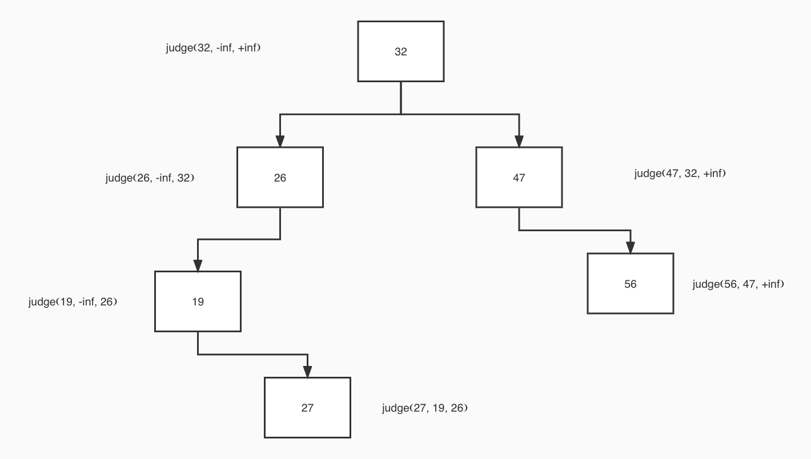

验证二叉搜索树
有效 二叉搜索树定义如下：
* 节点的左子树只包含 小于 当前节点的数。
* 节点的右子树只包含 大于 当前节点的数。
* 所有左子树和右子树自身必须也是二叉搜索树。

可以给每个节点设置上下界,节点要满足 下界<val<上界(开区间),不断的递归左右子树
* 左子树设置上界
* 右子树设置下界

[32,26,47,19,null,null,56,null,27]

该树的具体判断逻辑如下
