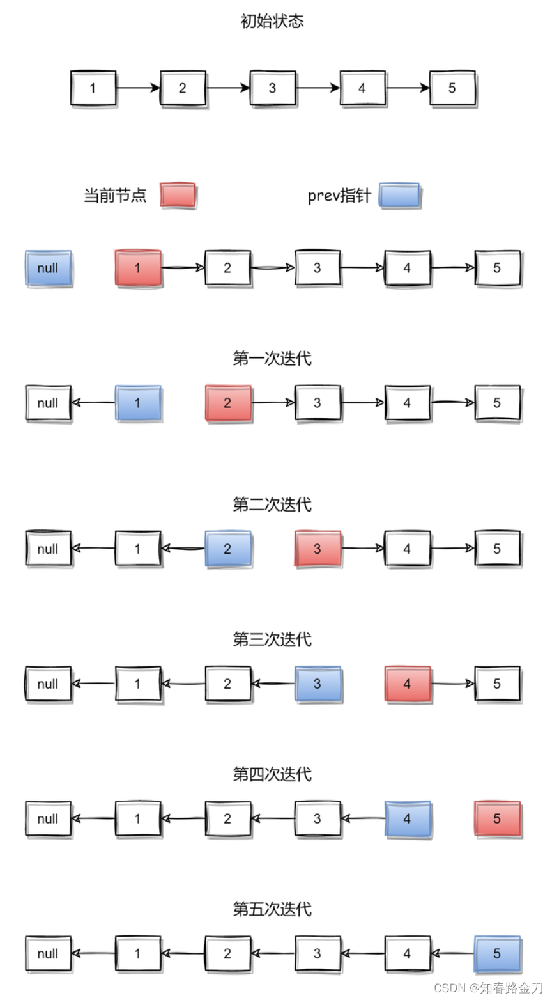

# Url:https://leetcode-cn.com/problems/reverse-linked-list/

## 题目:
给你单链表的头节点 head ，请你反转链表，并返回反转后的链表。

示例 1：


输入：head = [1,2,3,4,5]
输出：[5,4,3,2,1]
示例 2：


输入：head = [1,2]
输出：[2,1]
示例 3：

输入：head = []
输出：[]


提示：
链表中节点的数目范围是 [0, 5000]
-5000 <= Node.val <= 5000

进阶：链表可以选用迭代或递归方式完成反转。你能否用两种方法解决这道题？

---
## 解:
### 递归:
```go
//递归版本
func reverseList(head *ListNode) *ListNode {
	//判断结束条件，head为nil或者head.Next为nil直接返回
	if head == nil || head.Next == nil {
		return head
	}

	//递归进入下一个节点
	next := reverseList(head.Next)

	//将当前节点的子节点的Next指向自己,相当于4->5->nil变成4->5->4
	head.Next.Next = head
	//删除当前节点的子节点,相当于4->5->4 变成 5->4->nil
	head.Next = nil

	//返回最后节点
	return next
}
```


### 迭代:
```go
func reverseList(head *ListNode) *ListNode {
	//记录前驱节点
	var pre *ListNode

	//迭代链表
	for head != nil {
		//记录当前节点的子节点
		next := head.Next
		//当前节点指向前驱节点
		head.Next = pre
		//前驱节点后移
		pre = head
		//当前节点后移
		head = next
	}

	return pre
}
```

