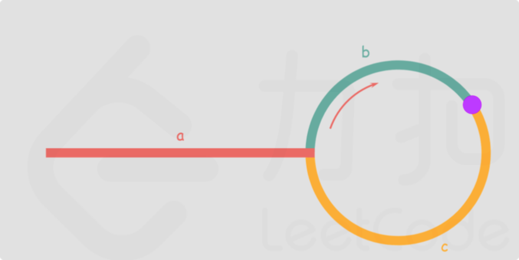

快慢指针相遇时

slow走了a+b

fast走了n圈为a+n(b+c)+b=a+(n+1)b+nc

由于fast一次走两步 slow一次走一步
所有fast在任意节点都是slow的两倍

所以2(a+b)=a+(n+1)b+nc

a=(n+1)b+nc-2b

a=(n-1)b+nc

a=(n-1)(b+c)+c

b+c等于一圈  相当于在原地不动 可等价为0

所以a = c

由此得出slow和fast相遇时,只需要将slow和head同时移动,直到他们相遇即为环的入口